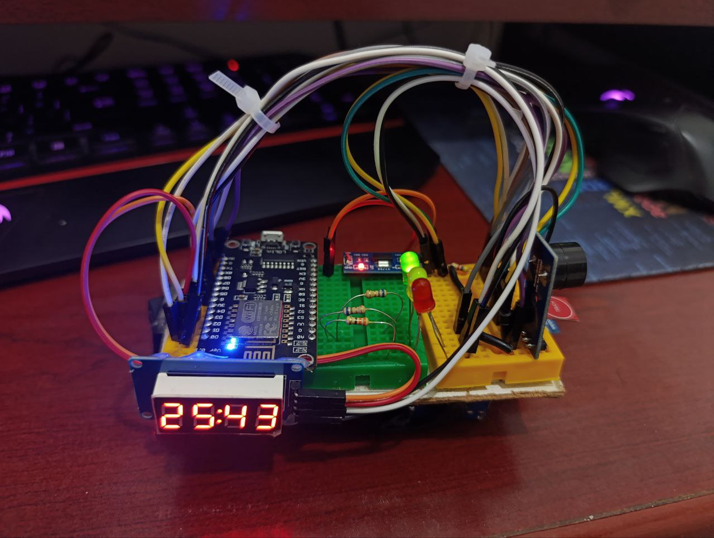

# Temperature IoT Monitoring System

A smart IoT-based temperature monitoring system built with **ESP8266 (NodeMCU)** that provides real-time temperature tracking, web-based control, data logging, and multi-level alerts.



## 📋 Table of Contents

- [Features](#features)
- [Project Structure](#project-structure)
- [Hardware Requirements](#hardware-requirements)
- [Software Requirements](#software-requirements)
- [Installation & Setup](#installation--setup)
- [Configuration](#configuration)
- [How It Works](#how-it-works)
- [Web Interface](#web-interface)
- [API Endpoints](#api-endpoints)
- [Hardware Setup](#hardware-setup)
- [Troubleshooting](#troubleshooting)
- [License](#license)

---

## ✨ Features

- **Real-Time Temperature Monitoring**: Reads temperature from DS18B20 digital sensor
- **Web-Based Control Panel**: Responsive web interface accessible from any browser
- **Temperature Thresholds**: Configurable green (normal) and yellow (warning) limits
- **Multi-Level Alerts**:
  - Green Status: Temperature is normal
  - Yellow Status: Temperature exceeds green limit (warning)
  - Red Status: Temperature exceeds yellow limit (critical)
- **Visual Feedback**:
  - RGB LED indicators for status
  - 7-Segment Display (TM1637) for temperature or time display
  - Buzzer alerts for critical temperatures
- **Data Logging**: Automatic temperature logging to LittleFS
- **RTC Support**: Real-time clock (DS3231) for accurate timestamps
- **Sound Toggle**: Web interface option to enable/disable buzzer alerts
- **Display Toggle**: Switch between temperature and time display on 7-segment
- **WiFi Connectivity**: Static IP configuration for stable connection

---

## 📁 Project Structure

```
tempature-iot/
├── src/
│   ├── main.cpp              # Main application controller & web server routing
│   ├── LogHelper.cpp         # Temperature logging to LittleFS
│   └── LogHelper.h           # Logging function declarations
├── include/
│   ├── AppConfig.h           # Hardware pins, network config, data structures
│   └── WebPages.h            # HTML/CSS/JavaScript for web interface (PROGMEM)
├── platformio.ini            # PlatformIO project configuration
├── Doxyfile                  # Doxygen documentation configuration
└── README.md                 # This file
```

### Code Overview

| File | Purpose |
|------|---------|
| `main.cpp` | Core application logic: hardware initialization, temperature reading, web server, alert system |
| `LogHelper.h/cpp` | Functions for logging temperature data to LittleFS filesystem |
| `AppConfig.h` | Pin definitions, WiFi credentials, network settings, configuration struct |
| `WebPages.h` | HTML/CSS/JavaScript web interface stored in program memory (PROGMEM) |

---

## 🔧 Hardware Requirements

| Component | Model | Purpose |
|-----------|-------|---------|
| Microcontroller | NodeMCU ESP8266 | Main controller |
| Temperature Sensor | DS18B20 (1-Wire) | Digital temperature measurement |
| Display | TM1637 7-Segment | Real-time temperature/time display |
| Real-Time Clock | DS3231 (I2C) | Accurate timekeeping & timestamps |
| Status LEDs | RGB LED (3x separate) | Visual status indicators (Green, Yellow, Red) |
| Buzzer | Active Buzzer | Audio alerts for critical temperatures |
| Touch Button | Capacitive/Push Button | Manual display toggle |
| WiFi Antenna | ESP8266 built-in | Wireless connectivity |

---

## 💻 Software Requirements

### Compiling & Uploading

- **PlatformIO**: Recommended (IDE extension or CLI)
- **Arduino IDE**: Alternative option (requires manual library installation)
- **Python 3.x**: Required for PlatformIO

### Dependencies (Auto-installed via PlatformIO)

```
- TM1637@0.0.0-alpha         # 7-Segment display driver
- ArduinoJson@^7.4.2         # JSON parsing (future API use)
- DallasTemperature@^4.0.5   # DS18B20 sensor library
- RTClib@^2.1.4              # DS3231 RTC library
```

---

## 🚀 Installation & Setup

### Step 1: Clone the Repository

```bash
git clone https://github.com/PooyaRezaee/tempature-iot.git
cd tempature-iot
```

### Step 2: Configure WiFi & Network Settings

Edit [include/AppConfig.h](include/AppConfig.h):

```cpp
// Line ~28-30: Update WiFi credentials
const char* const WIFI_SSID = "YOUR_SSID";
const char* const WIFI_PASS = "YOUR_PASSWORD";

// Line ~23-26: Update static IP (optional)
const IPAddress LOCAL_IP(10, 71, 74, 100); 
const IPAddress GATEWAY(10, 71, 74, 98);
```

### Step 3: Upload Firmware

**Using PlatformIO CLI:**
```bash
platformio run --target upload
```

**Using PlatformIO IDE:**
1. Open project folder in VS Code with PlatformIO extension
2. Click "Build" and "Upload" buttons

**Using Arduino IDE:**
1. Install required libraries from Library Manager
2. Select board: `NodeMCU 1.0 (ESP-12E Module)`
3. Select port and upload

### Step 4: Monitor Serial Output

```bash
platformio device monitor --baud 115200
```

---

## ⚙️ Configuration

### Temperature Thresholds

**Via Web Interface:**
1. Navigate to `http://<device-ip>/limits`
2. Set green limit (normal) and yellow limit (warning)
3. Changes are saved to EEPROM automatically

**Via Code (Default):**
```cpp
// src/main.cpp - Line ~40
if (isnan(config.greenLimit)) { 
    config.greenLimit = 25.0;    // Default: 25°C
    config.yellowLimit = 30.0;   // Default: 30°C
    config.webSoundEnabled = true;
}
```

### Pin Configuration

All pin definitions are in [include/AppConfig.h](include/AppConfig.h):

```cpp
#define PIN_DS18B20      D5  // Temperature sensor
#define PIN_LED_GREEN    D8  // Green status LED
#define PIN_LED_YELLOW   D4  // Yellow status LED
#define PIN_LED_RED      D0  // Red status LED
#define PIN_TOUCH        D6  // Display toggle button
#define PIN_BUZZER       D7  // Audio alert
#define PIN_CLK_DIS      3   // 7-Segment clock (RX pin)
#define PIN_DIO_DIS      D3  // 7-Segment data
#define SDA_PIN          D2  // I2C data (RTC)
#define SCL_PIN          D1  // I2C clock (RTC)
```

---

## 🔄 How It Works

### Temperature Reading & Alerts

```
┌─────────────────────────────────────────┐
│   Read DS18B20 Temperature Sensor        │
│   (Every ~1 second)                      │
└────────────┬────────────────────────────┘
             ▼
    ┌────────────────────┐
    │ Compare with Limits│
    └──┬────┬────┬──────┘
       ▼    ▼    ▼
    Normal Warning Critical
    (≤Green)(≤Yellow)(>Yellow)
       │      │         │
       ▼      ▼         ▼
    Green  Yellow      Red
    LED    LED + Buzz  LED + Buzz
```

### Data Flow

1. **Hardware Initialization** (setup):
   - Configure I/O pins
   - Initialize I2C for RTC
   - Initialize 1-Wire for temperature sensor
   - Connect to WiFi
   - Start web server
   - Load saved configuration from EEPROM

2. **Main Loop**:
   - Read temperature every second
   - Check against thresholds
   - Update LED status and buzzer
   - Log temperature to LittleFS
   - Update 7-segment display (temperature or time)
   - Handle web requests

3. **Web Server**:
   - Serves HTML/CSS/JavaScript dashboard
   - Provides JSON API for status updates
   - Accepts configuration changes
   - Manages data logging

---

## 🌐 Web Interface

### Dashboard

Access the main control panel:
```
http://<device-ip>/
```

**Features:**
- Real-time temperature display
- Current date and time
- Temperature status (Normal/Warning/Critical)
- Data logging statistics
- Web sound toggle
- Quick access buttons

### Available Pages

| URL | Purpose |
|-----|---------|
| `/` | Main dashboard |
| `/limits` | Set temperature thresholds |
| `/set_time` | Adjust RTC date/time |
| `/history` | View temperature log chart |

---

## 📡 API Endpoints

### GET /status
Returns current system status as JSON.

**Response:**
```json
{
  "temp": 24.5,
  "time": "14:30:45",
  "date": "2025/01/02",
  "green": 25.0,
  "yellow": 30.0,
  "webSound": true,
  "logCount": 1250,
  "logSize": 45
}
```

### GET /limits
Returns current temperature thresholds.

**Response:**
```json
{
  "green": 25.0,
  "yellow": 30.0
}
```

### POST /set_limits
Updates temperature thresholds (sent from web form).

### GET /toggle_sound
Toggles web buzzer alert on/off.

### GET /toggle_disp
Toggles display between temperature and time.

### GET /clear_log
Clears all logged temperature data.

### GET /get_history
Returns temperature log data for charting (if implemented).

---

## 🎛️ Hardware Setup

### Wiring Diagram

```
NodeMCU ESP8266
    │
    ├─── D5 (GPIO14) ──────┬─── DS18B20 Sensor
    │                       └─── 4.7kΩ Pull-up Resistor
    │
    ├─── D8 (GPIO15) ──────── Green LED (+) ── 220Ω ── GND
    ├─── D4 (GPIO2)  ──────── Yellow LED (+) ── 220Ω ── GND
    ├─── D0 (GPIO16) ──────── Red LED (+) ── 220Ω ── GND
    │
    ├─── D7 (GPIO13) ──────── Buzzer (+) ── GND
    │
    ├─── D6 (GPIO12) ──────── Touch Button ── GND (with pull-up)
    │
    ├─── D1 (GPIO5)  ──────┬─── SCL (DS3231 RTC)
    ├─── D2 (GPIO4)  ──────┼─── SDA (DS3231 RTC)
    │                       └─── 4.7kΩ Pull-up on both
    │
    ├─── RX (GPIO3)  ──────── TM1637 CLK (7-Segment)
    ├─── D3 (GPIO0)  ──────── TM1637 DIO (7-Segment)
    │
    ├─── 3.3V ───────┬───── LED Power (+)
    │                ├───── Sensor VCC
    │                ├───── RTC VCC
    │                └───── Display VCC
    │
    └─── GND ────────────── Common Ground (all components)
```

### Board Photo Placeholder


*Add your actual board photo/schematic here after assembly*

---

## 🐛 Troubleshooting

### Temperature Sensor Not Reading

- ✓ Check DS18B20 wiring (especially pull-up resistor on data line)
- ✓ Verify pin configuration in `AppConfig.h`
- ✓ Check serial monitor for error messages

### WiFi Connection Fails

- ✓ Verify SSID and password in `AppConfig.h`
- ✓ Check IP address isn't already in use
- ✓ Restart router and device
- ✓ Check WiFi signal strength

### RTC Not Keeping Time

- ✓ Verify I2C wiring (SDA/SCL pins and pull-up resistors)
- ✓ Check DS3231 battery is installed
- ✓ Use web interface to set current time

### Web Interface Not Accessible

- ✓ Check device IP address from serial monitor
- ✓ Ensure device and computer are on same network
- ✓ Verify web server started (check serial output)
- ✓ Clear browser cache or try incognito mode

### Display Not Showing Temperature

- ✓ Check TM1637 wiring (CLK and DIO pins)
- ✓ Verify pin definitions in `AppConfig.h`
- ✓ Ensure display has power (3.3V)

---

## 📝 License

This project is open source. Feel free to use, modify, and distribute.

---

## 🤝 Contributing

Found a bug or have an improvement? Feel free to open an issue or submit a pull request!

---

**Author:** Pooya Rezaee  
**Repository:** [https://github.com/PooyaRezaee/tempature-iot](https://github.com/PooyaRezaee/tempature-iot)  
**Created:** 2025

---

## 📚 Additional Resources

- [ESP8266 Documentation](https://arduino-esp8266.readthedocs.io/)
- [DallasTemperature Library](https://github.com/milesburton/Arduino-Temperature-Control-Library)
- [TM1637 Display](https://github.com/smougenot/TM1637)
- [RTClib Documentation](https://github.com/adafruit/RTClib)
